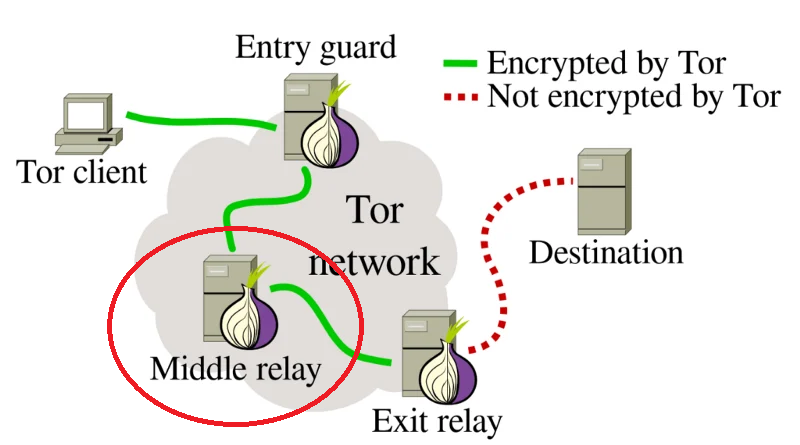
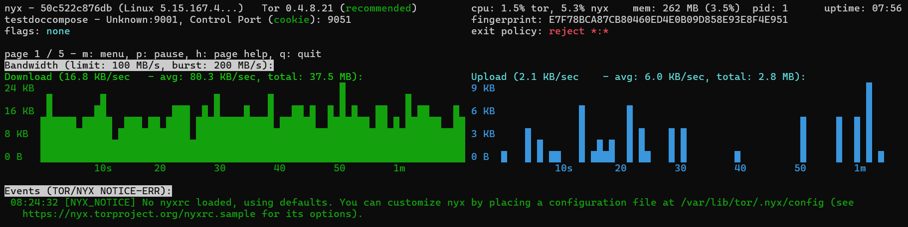

# Tor Middle Relay with Nyx Monitoring

This project sets up a **Tor Middle Relay** with **Nyx monitoring** using Docker.  
It is designed to run safely on a personal computer without creating an exit node, so there is **no legal risk**. The setup uses Docker to isolate Tor and Nyx for secure operation.





---

## 📌 Features

- Tor Middle Relay (non-exit, participates in Tor circuits)
- Nyx monitoring for real-time relay statistics
- Configurable bandwidth limits
- Persistent data using Docker volumes
- ControlPort secured for local access only
- Easy installation and launch with Docker Compose

---

## 🛠 Prerequisites

- Windows 10/11 or Linux
- Docker Desktop installed
- Docker Compose installed
- Basic command line knowledge

---

## 🔧 Installation

1. Clone or download this repository:

2. Customize the torrc file to your liking

3. Build and start the relay
    ```
    docker-compose up -d --build
    ```
4. Check in the log file if everything started correctly
    ```
    docker logs -f tor-middle_comp
    ```
5. Check Nyx to have a live monitoring of your node
    ```
    docker exec -it tor-middle_comp nyx
    ```
